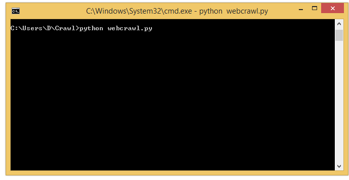
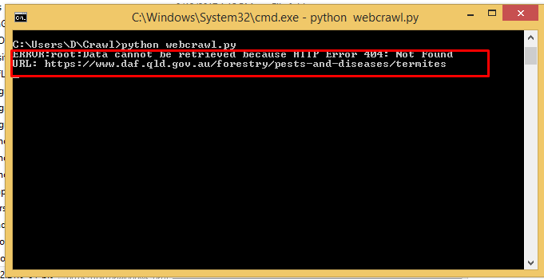
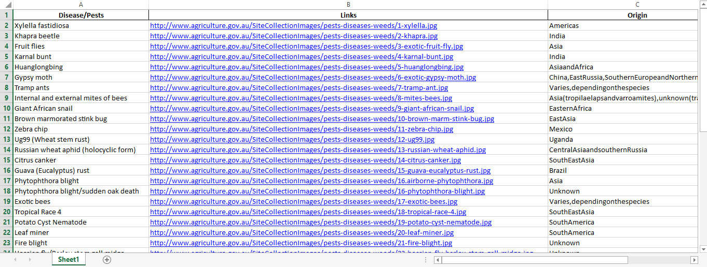
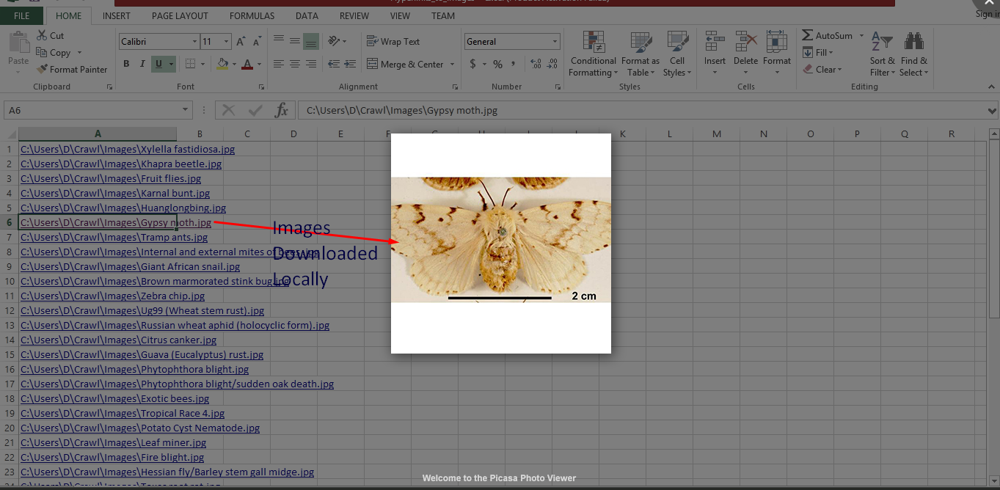

# WebCrawl
Extract data from a web page using **BeautifulSoup** and exporting it to Excel

:star: **Star me on GitHub — it helps!**

### Table of content
- [Installation](#installation)
- [About Data](#About-Data)
- [Executing Py File](#Executing-Py-File)
- [Errors logging in case of 404](#Errors-logging-in-case-of-404)
- [Excel Generated with Data](#Excel-Generated-with-Data)
- [Images stored on excel locally and can be accesed via local links](#Images-stored-on-excel-locally-and-can-be-accesed-via-local-links)

## Installation

This Project would require 

- beautifulsoup 4.7.1
- openpyxl 2.6.2
- pandas 0.24.2
- requests 2.20.1
- urllib3 1.24.2
- XlsxWriter 1.1.8

## About Data

The Excel data is scraped through http://agriculture.gov.au/pests-diseases-weeds/plant
via **BeautifulSoup** in Python

## Executing Py File

## Errors logging in case of **404**

## Excel Generated with Data

 - Images are Downloaded from Web Page
## Images stored on excel locally and can be accesed via local links

